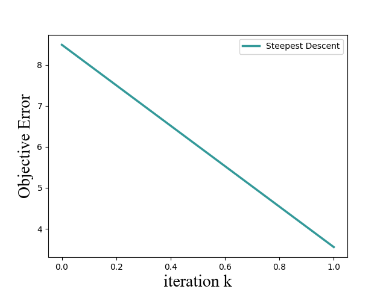
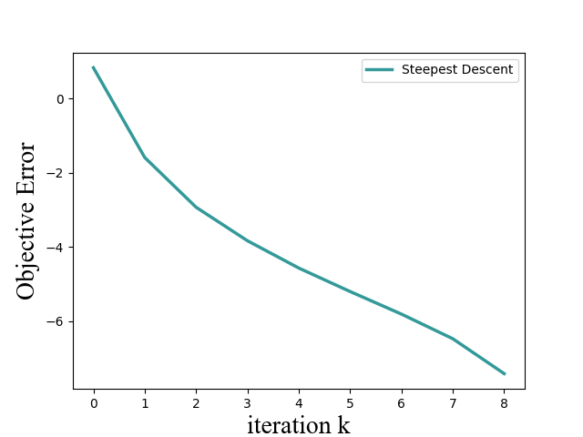
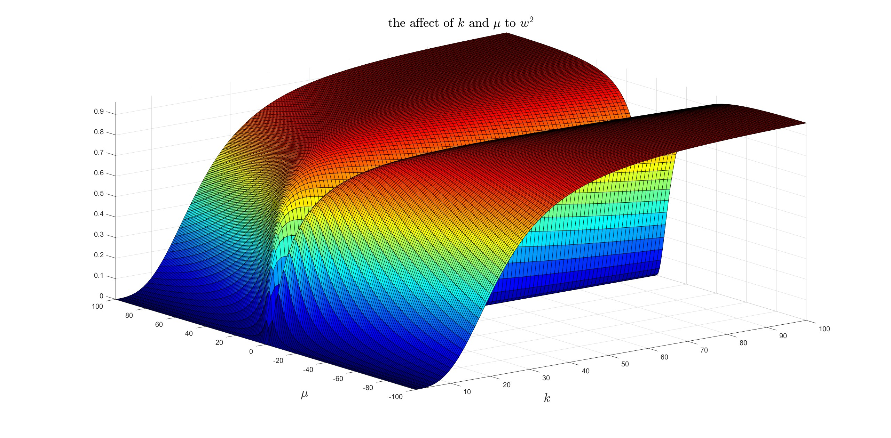

# 问题引入
本质是求二次规划问题(Quadratic Form)的最小值,形式如下
$$x^* \in \min_{x} \, f(x) = \min_{x}\,\frac{1}{2}x^T A x -b^T x+c$$
如果$A$是对称正定，那么该问题其实就相当于求解方程$Ax^* = b$，因为根据求极值公式，
$$f^{'}(\bar{x})=0$$
即可求出$\bar{x}$对应的最小值，又因为$f^{'}(\bar{x})=\frac{1}{2}(A+A^T)\bar{x}-b$，所以当$A=A^T$，$f^{'}(\bar{x})=0$等价为$A\bar{x}-b=0$，所以说求解Quadratic Form形式的最优解就相当于求解一个线性系统(linear system)。***那么$A\in \mathbb{R}_{++}^n$又有什么用呢？*** 也就是说他能给解决问题带来什么好处呢？\
All in all, $A$是正定矩阵，严格保证了满足$Ax=b$的就是问题的全局最优解(global optimal)。假定在最优点$x^*$附近的任意扰动$e$，也就是说$x^*$满足$Ax^8=b$，那么根据$f(x)$表达式，可以知道，
$$\begin{equation}
\begin{aligned}
 f(x^*+e)&=\frac{1}{2}(x^*+e)^T A(x^*+e)-b^T(x^*+e)+c \\
         &=\frac{1}{2}(x^{*})^TAx^* - b^Tx^* +c + \frac{1}{2}e^TAe-b^Te+e^TAx^* \\
         &= f(x^*)+e^Tb+\frac{1}{2}e^TAe-b^Te \quad \bm{(使用等式Ax^*=b证明该式)}\\
         &= f(x^*) + \frac{1}{2}e^TAe 
\end{aligned}
\end{equation}$$
由于$A$是正定矩阵，所以$e^TAe >0$，也就是说任何异于$x^*$点都不可能取到最优值，也就是说最优值有且只有一个$x^*$。从几何直观上理解，$A$为正定矩阵，有且只有一个最优解，$A$为半正定矩阵，可能有解，但是一旦有解就可能会有多个对应相同最优值的最优解。***注意$f(x)$中的系数各有作用，$A$控制着形状，特征值$\lambda(A)$控制着轴的长度，特征向量规范化所决定的正交矩阵决定了旋转的方向；而$A$和$b$共同控制着最优解的取值，而他们一起控制最优值。***

# Steepest Descent
下降法都有一个一般的更新公式,
$$x(k+1)=x(k)+\alpha(k)d(k)$$
其中$\alpha(k)$为第k代的步长(step size)，$d(k)$为第k代的搜索方向(search direction)。一般这种算法都会规定一个搜索方向，然后根据精确的(exact)或者不精确的(inexact)的搜索来决定步长，这两个确定步长的差异在于，exact方法确定的步长是精确的，并且可以较少代数收敛，但是每次计算exact步长的代价较大，inexact方法的步长是不精确的，需要较多代数收敛，但是每次计算代价小，可以得到工程应用的近似最优解。  
## Search Direction 

同样的，令$d(k)$为待优化问题的负梯度方向便可以得到steepest descent的搜索方向，即$d(k)=-\nabla f(x(k))=b-Ax(k)$，$b-Ax(k)$的物理意义是残差(residual)，于是定义$r(k)=b-Ax(k)=-f^{'}(x(k))$，误差$e(k)=x(k)-x^*$为偏离最优解的程度。那么$r(k)$可以表示为$r(k)=Ax^* -Ax(k) = A(x^*-x(k))=-Ae(k)$，于是有以下关系，
$$
\begin{equation}
\begin{aligned}
 d(k)&=b-Ax(k)=-f^{'}(x(k))=-Ae(k) \\
 r(k)&=b-Ax(k)=-f^{'}(x(k))=-Ae(k)\\
 e(k)&=x(k)-x^*=-A^T f^{'}(x(k))= -A^T r(k)\\
 r(k)&=d(k)
\end{aligned}
\end{equation}$$
搜索方向即为残差方向。
## Step Size 
### Exact Linesearch
如果当前在第$0$代，那么这个时候要选择一个第$0$代的步长使得前进到$x(1)$时对应的$f(x(1))$最小，同样其他代数也可以类似的描述，如果当前在第$k$代，那么这个时候要选择一个第$k$代的步长使得前进到$x(k+1)$时对应的$f(x(k+1))$最小，数学描述如下，
$$
\begin{equation}
\alpha(k) = \mathop{\arg\min}_{\alpha}f(x(k+1))
\end{equation}
$$
由于$f(x(k+1))$是可微的，所以对应的$\alpha(k)$可以用求极值条件求得，
$$
\begin{equation}
\begin{aligned}
\frac{d}{d \alpha} f(x(k+1)) &= \frac{d}{d \alpha} f(x(k)+\alpha d(k)) \\
          &= [f^{'}(x(k)+\alpha d(k))]^T \, d(k) \\
          &= [f^{'}(x(k)+\alpha d(k))]^T \,r(k) \\
          &= 0
\end{aligned}
\end{equation}
$$
因此有一个重要条件$\bm{\langle f^{'}(x(k+1)), d(k)\rangle=0}$，等价于$\bm{\langle d(k+1), d(k)\rangle=\langle r(k+1), r(k)\rangle=0}$，这个条件只是精确的线搜索的一个by-product，下面确定$\alpha$取值，
$$\begin{equation}
\begin{aligned}
    &r^T(k+1)r(k)=0 \\
    &\Leftrightarrow -f^{'}(x(k+1))r(k)=0 \\
    &\Leftrightarrow  (b-Ax(k+1))^T r(k) = 0\\
    &\Leftrightarrow  \{b-A[x(k)+\alpha(k)r(k)] \}^T r(k) = 0\\
    &\Leftrightarrow  \alpha(k)r^T(k)A^T r(k) = (b-Ax(k))^Tr(k) \\
    &\Leftrightarrow  \alpha(k) = \frac{r(k)^T r(k)}{r^T(k)A^T r(k)}=\frac{d(k)^T d(k)}{d^T(k)A^T d(k)} \quad \bm{(A=A^T,所以这里A和A^T可以互相转化)}
\end{aligned}
\end{equation}$$
于是可以得到下面两套算法流程，\

> $\underline{Algorithm 1: Steepest Descent with Exact Line Search}$\
  $Initializing:$ $arbitrarily$ $select$ $x(0)$ \
  $for$ $k = 0,1,2,3...$ \
    $\quad \quad d(k) = b - Ax(k)$\
    $\quad \quad \alpha(k)=\frac{d(k)^T d(k)}{d^T(k)A^T d(k)}$\
    $\quad \quad x(k+1)=x(k)+\alpha(k)d(k)$ \

算法二则是将算法一的$x$的更新表达式两边同时乘矩阵$A$,然后同时加上$b$，可以得到新的$d(k+1)$更新表达式为$d(k+1) = d(k)-A\alpha(k)d(k)$，于是便有算法二\
> $\underline{Algorithm 2: Another Steepest Descent with Exact Line Search}$\
  $Initializing:$ $arbitrarily$ $select$ $x(0),d(0)=b-Ax(0)$ \
  $for$ $k = 0,1,2,3...$ \
    $\quad \quad \alpha(k)=\frac{d(k)^T d(k)}{d^T(k)A^T d(k)}$\
    $\quad \quad x(k+1)=x(k)+\alpha(k)d(k)$\
     $\quad \quad d(k+1)=d(k)-A\alpha(k)d(k)$

算法二方向(也可以说残差)更新，没有用到$x(k)$，因此会造成没有反馈(feedback)，因此积累的浮点数误差会使得算法二中$x$只能收敛到$x^*$的邻域内。

***一些重要发现***
1. 商业求解器SCS求解Quadratic form形式问题不能到达最优解，仍然有一定误差
2. steepest descent exact line search形式在第n代（n为feature dim，也就是待优化变量的维数）就可以收敛，如果算法继续运行，特别是当前解接近最优解时算法速度非常慢。

### Inexact Linesearch

## Numerical Experience

### Exact
为了能够使用等高线描绘出搜索路径，并直观验证公式的正确性，先考虑简单二维问题（优化变量$x$是二维）
$$\begin{equation}
f(x) = x^T \begin{pmatrix} 2&1 \\ 1&2\end{pmatrix}x-\begin{pmatrix} 1\\-1 \end{pmatrix}^Tx
\end{equation}$$
Steepest Descent无论初始点选在哪里，起初的收敛速度的很快的，但是到迭代后期收敛非常慢，如果把迭代次数设置成100，通过无限放大可以发现，该算法总是在商业求解器(SCS)所求得的最优解附近，并且可以观察到和验证的一样，相邻两次前进的方向,i.e.$d(k+1),d(k)$是正交的。

算法2的误差其实和算法1原文说舍入误差比较大，但是由于现代计算精度的提升和迭代次数增多，几乎看不出来。

***迭代曲线的纵坐标都是以log来表示的***

发现：
优化变量在500个左右都能很快求解一旦到达1000，求解时间大大增加

### Inexact

## Convergence Analysis of Steepest Descent
### Exact Method
***General Convergence Analysis*** \
根据公式$\fbox{1}$，如果将其中的$x^*+e$记作$x(k+1)$，则$e=x(k+1)-x^*=e(k+1)$那么有，
$$\begin{equation}
f(x(k+1)) = f(x^*)+\frac{1}{2}(e(k+1))^TAe(k+1))
\end{equation}
$$
公式$\fbox{7}$说明，优化$f(x(k+1))$和优化$(e(k+1))^TAe(k+1))$是等价的，定义energy norm $||e||_{A}=(e^TAe)^{1/2}$，自然我们想探究$||e(k)||_{A}$和$||e(k+1)||_{A}$之间是什么关系呢，也就是想看当前目标函数值是以什么样的方式下降的，于是想把$||e(k+1)||_{A}$用$||e(k)||_{A}$表示出来，于是有，
$$\begin{equation}
\begin{split}
||e(k+1)||_{A}^2 &= e(k+1)^TAe(k+1) \\
&= (e(k)+\alpha(k)d(k))^TA(e(k)+\alpha(k)d(k)) \quad \bm{(x(k+1)=x(k)+\alpha(k)d(k)两边同时减去x^*)}\\
&= (e(k))^TAe(k)+\alpha(k)(e(k))^TAd(k)+\alpha(k)(d(k))^TAe(k)+\alpha^2(k)(d(k))^TAd(k) \\
&=||e(k)||_{A}^2+2\alpha(k)(e(k))^TAd(k)+\alpha^2(k)(d(k))^TAd(k) \quad \bm{[(e(k))^TAd(k)=(Ae(k))^Td(k)=(d(k))^TAe(k)]}\\
&=||e(k)||_A^2(1-\frac{(d(k)^Td(k))^2}{(d(k)^TAd(k))(e(k)^TAe(k))})\quad \bm{(\alpha(k)=\frac{d(k)^T d(k)}{d^T(k)A^T d(k)}代入上面一行即可得到该式)}\\
\end{split}
\end{equation}
$$
因为实对称矩阵有$n$个正交的特征向量，所以对称矩阵$A$存在$n$个正交特征向量，分别为$v_1,v_2,\dots,v_n$，由于特征向量$v_i$无论倍乘一个多少，都是$A$的特征向量，所以可以令每个特征向量为单位向量，因此他们满足以下关系,
$$
\begin{equation}
v_i^Tv_j= \begin{cases} 1,\quad i=j \\ 0,\quad i \neq j\end{cases}
\end{equation}
$$
由于矩阵$A$是$n$维，因此任何一个$n$维空间的向量都可以由这$n$个单位正交向量张成(span)，所以$d(k),r(k),e(k)$都可以由这$n$个单位正交基表示，这里只令$e(k)$由这些单位正交基表示，其余的优化变量的表示方法同理，
$$
\begin{equation}
e(k)=\sum_{i=1}^{n} \xi_{i}v_{i}
\end{equation}
$$
于是其余的变量$r(k),e(k)^TAe(k),d(k)^Td(k),d(k)^TAd(k)$可以表示如下，
$$
\begin{equation}
\begin{split}
r(k)&=-Ae(k)=-A\sum_{i=1}^{n} \xi_{i}v_{i}=-\sum_{i=1}^{n}\xi_iAv_i=-\sum_{i=1}^{n}\xi_i\lambda_i v_i\\
e(k)^TAe(k) &= (\sum_{i=1}^{n} \xi_{i}v_{i})A(\sum_{i=1}^{n} \xi_{i}v_{i})=(\xi_1v_1+...+\xi_nv_n)(\xi_1\lambda_1v_1+...+\xi_n\lambda_nv_n)=\sum_{i=1}^{n} \xi_i^2\lambda_i \\
d(k)^Td(k) &= r(k)^Tr(k)=(\sum_{i=1}^{n}\xi_i\lambda_i v_i)(\sum_{i=1}^{n}\xi_i\lambda_i v_i)=\sum_{i=1}^{n}\xi_i^2\lambda_i^2 \\
d(k)^TAd(k) &=r(k)^TAr(k)=(\sum_{i=1}^{n}\xi_i\lambda_i v_i)(\sum_{i=1}^{n}\xi_i\lambda_i^2 v_i)=\sum_{i=1}^{n}\xi_i^2\lambda_i^3
\end{split}
\end{equation}
$$
因此$||e(k+1)||_{A}^2$可以表示为，
$$
\begin{equation}
\begin{split}
||e(k+1)||_{A}^2 &= ||e(k)||_A^2(1-\frac{(d(k)^Td(k))^2}{(d(k)^TAd(k))(e(k)^TAe(k))}) \\
&=||e(k)||_A^2(1-\frac{(\sum_{i=1}^{n}\xi_i^2\lambda_i^2)^2}{(\sum_{i=1}^{n}\xi_i^2\lambda_i^3)(\sum_{i=1}^{n}\xi_i^2\lambda_i)})
\end{split}
\end{equation}
$$
定义$w^2=1-\frac{(\sum_{i=1}^{n}\xi_i^2\lambda_i^2)^2}{(\sum_{i=1}^{n}\xi_i^2\lambda_i^3)(\sum_{i=1}^{n}\xi_i^2\lambda_i)}$，这么定义的好处是显示表示了$w^2 \ge 0$，如果定义$w$，那么还要额外增加条件$w\ge 0$。为了更清楚看出收敛速度和参数之间的关系，定义矩阵$A$的条件数$\mathfrak{k}=\lambda_1/\lambda_2 \bm{(\lambda_1\ge\lambda_2)}$，残差$e(k)$的斜率定义为$\mu=\xi_2/\xi_1$，于是$w^2$可以写为为，
$$
\begin{equation}
  w^2 = 1-\frac{(\mathfrak{k}^2+\mu^2)^2}{(\mathfrak{k}+\mu^2)(\mathfrak{k}^3+\mu^2)}
\end{equation}
$$
特别注意当$A=A^T,A\in \mathbb{R}^n_{++}$时$k\ge1,\mu \in \mathbb{R}$，下图展示了不同$k,\mu$取值对$w^2$的影响，

- 矩阵条件数接近1时，无论残差斜率如何变化都能获得较小的$w^2$，也就是说待解决的二次规划问题如果矩阵$A$最大特征值和最小特征值相差不大（二次型近似于一个球），无论初始值取什么算法都能获得较快收敛速度，算法收敛速度对初始解选取不敏感。
- 当矩阵条件数较大时，$w^2$图像上会出现一个凹槽，说明初始值对应的斜率只有取在凹槽附近才能有较快收敛速度，此时算法对初始值的选取敏感。

在实际过程中，二次规划问题的$k$通常是固定的，通过对$w^2$求$\mu$的微分，当$\mathfrak{k}=\pm \mu$时$w^2$有唯一极大值，也就是最大值，算法收敛速度最慢。可以证明如果初始解选取刚好满足$\mu=\pm \mathfrak{k}$，那么第2个解必然满足$\mu=\mp \mathfrak{k}$，依此类推第k个解为$\mu = (-1)^{k+1}(\pm \mathfrak{k})$。
同时根据极值判定，当$\mu^2 =\mathfrak{k}^2$可以求出$w^2$的上界,
$$
\begin{equation}
\begin{split}
  w^2 &\le \frac{(\mathfrak{k}-1)^2}{(\mathfrak{k}+1)^2} \\
  \Leftrightarrow w &\le \frac{\mathfrak{k}-1}{\mathfrak{k}+1}
\end{split}
\end{equation}
$$

因此最速下降法的收敛结果的上界可以表示为，
$$
\begin{equation}
\begin{split}
  &||e(k+1)||_{A} \le (\frac{\mathfrak{k}-1}{\mathfrak{k}+1})||e(k)||_{A} \\
  \Leftrightarrow &||e(k)||_{A} \le (\frac{\mathfrak{k}-1}{\mathfrak{k}+1})^{k}||e(0)||_{A}
\end{split}
\end{equation}
$$

根据公式$\fbox{7}$，$f(x(k+1))-f(x^*)=\frac{1}{2}(e(k+1))^TAe(k+1)$，于是有,
$$
\begin{equation}
\begin{split}
  \frac{f(x(k))-f(x^*)}{f(x(0))-f(x^*)}=\frac{(e(k))^TAe(k)}{(e(0))^TAe(0)}\le (\frac{\mathfrak{k}-1}{\mathfrak{k}+1})^{2k}
\end{split}
\end{equation}
$$

# 附录
**对于二维问题如果初始解选取刚好满足$\mu=\pm \mathfrak{k}$，那么第2个解必然满足$\mu=\mp \mathfrak{k}$，依此类推第k个解为$\mu = (-1)^{k+1}(\pm \mathfrak{k})$的证明。**
>假设第$k$代残差斜率向量分别为$\xi_{k,1},\xi_{k,2},...,\xi_{k,n}$，那么第$k$代残差$e(k)$可以表示为,
$$e(k)=\sum_{i=1}^{2} \xi_{k,i}v_i$$
不失一般性，假设第一代初始解选取满足$\mu=\mathfrak{k}=\xi_{\cdot,2}/\xi_{\cdot,1}$，那么第一代残差可以写成，
$$
\begin{split}
e(1)&=\sum_{i=1}^{2} \xi_{1,i}v_i \\
    &= \xi_{1,1}v_1 + \xi_{1,2}v_2 \\
    &= \xi_{1,1}(v_1+\mathfrak{k}v_2) \\
e(2)&= e(1)+\alpha(1)d(1)\\
    &= \xi_{1,1}(v_1+\mathfrak{k}v_2) + \alpha(1)(-Ae(1)) \\
    &= \xi_{1,1}(v_1+\mathfrak{k}v_2) - \alpha(1)A\xi_{1,1}(v_1+\mathfrak{k}v_2) \\
    &= \xi_{1,1}(v_1+\mathfrak{k}v_2) - \alpha(1)\xi_{1,1}(\lambda_1v_1+\mathfrak{k}\lambda_2v_2) \\
    &= \xi_{1,1}[(1-\alpha(1)\lambda_1)v_1 + (1-\alpha(1)\lambda_2)\mathfrak{k}v_2]\\
    &= \xi_{2,1}v_1+\xi_{2,2}v_2\\
\end{split}$$
所以有,
$$
\begin{split}
  &\xi_{2,1} = \xi_{1,1}(1-\alpha(1)\lambda_1)
  \\
  &\xi_{2,2} = \mathfrak{k}\xi_{1,1}(1-\alpha(1)\lambda_2) \\
  \Rightarrow &\frac{\xi_{2,2}}{\xi_{2,1}}=\mathfrak{k}\frac{1-\alpha(1)\lambda_2}{1-\alpha(1)\lambda_1}
\end{split}$$
由于$\alpha(k)=\sum_i \xi_{k,i}^2\lambda_i^2/\sum_i \xi_{k,i}^2\lambda_i^3$，于是代入$\alpha(k)$到上式，可得，
$$
\begin{split}
\frac{\xi_{2,2}}{\xi_{2,1}}&=\mathfrak{k}\frac{\sum_i \xi_{1,i}^2\lambda_2^3-\lambda_2\sum_i\xi_{1,i}^2\lambda_i^2}{\sum_i \xi_{1,i}^2\lambda_2^3-\lambda_1\sum_i\xi_{1,i}^2\lambda_i^2} \\
&= -\mathfrak{k}
\end{split}
$$
现在假设$e(k)$对应的$\xi_{k,2}/\xi_{k,1}=\pm\mathfrak{k}$，那么有，
$$\begin{split}
e(k)&=\sum_{i=1}^{2} \xi_{k,i}v_i \\
    &= \xi_{k,1}v_1 + \xi_{k,2}v_2 \\
    &= \xi_{k,1}(v_1\pm\mathfrak{k}v_2) \\
e(k+1)&= e(k)+\alpha(k)d(k)\\
    &= \xi_{k,1}(v_1\pm\mathfrak{k}v_2) + \alpha(k)(-Ae(k)) \\
    &= \xi_{k,1}(v_1\pm\mathfrak{k}v_2) - \alpha(k)A\xi_{k,1}(v_1\pm\mathfrak{k}v_2) \\
    &= \xi_{k,1}(v_1\pm\mathfrak{k}v_2) - \alpha(k)\xi_{k,1}(\lambda_1v_1\pm\mathfrak{k}\lambda_2v_2) \\
    &= \xi_{k,1}[(1-\alpha(k)\lambda_1)v_1 \pm (1-\alpha(k)\lambda_2)\mathfrak{k}v_2]\\
    &= \xi_{k+1,1}v_1+\xi_{k+1,2}v_2\\
\end{split}$$
由于$\alpha(k)=\sum_i \xi_{k,i}^2\lambda_i^2/\sum_i \xi_{k,i}^2\lambda_i^3$，于是代入$\alpha(k)$到上式，可得，
$$
\begin{split}
\frac{\xi_{k+1,2}}{\xi_{k+1,1}}&=\pm\mathfrak{k}\frac{\sum_i \xi_{k,i}^2\lambda_2^3-\lambda_2\sum_i\xi_{k,i}^2\lambda_i^2}{\sum_i \xi_{k,i}^2\lambda_2^3-\lambda_1\sum_i\xi_{k,i}^2\lambda_i^2} \\
&= \pm\mathfrak{k}\frac{\xi_{k,1}^2\lambda_1^2(\lambda_1-\lambda_2)}{\xi_{k,2}^2\lambda_2^2(\lambda_2-\lambda_1)} \\
&= \pm\mathfrak{k}(\frac{1}{\mathfrak{k^2}})(\mathfrak{k}^2)(-1) \\
&= \mp \mathfrak{k}
\end{split}
$$