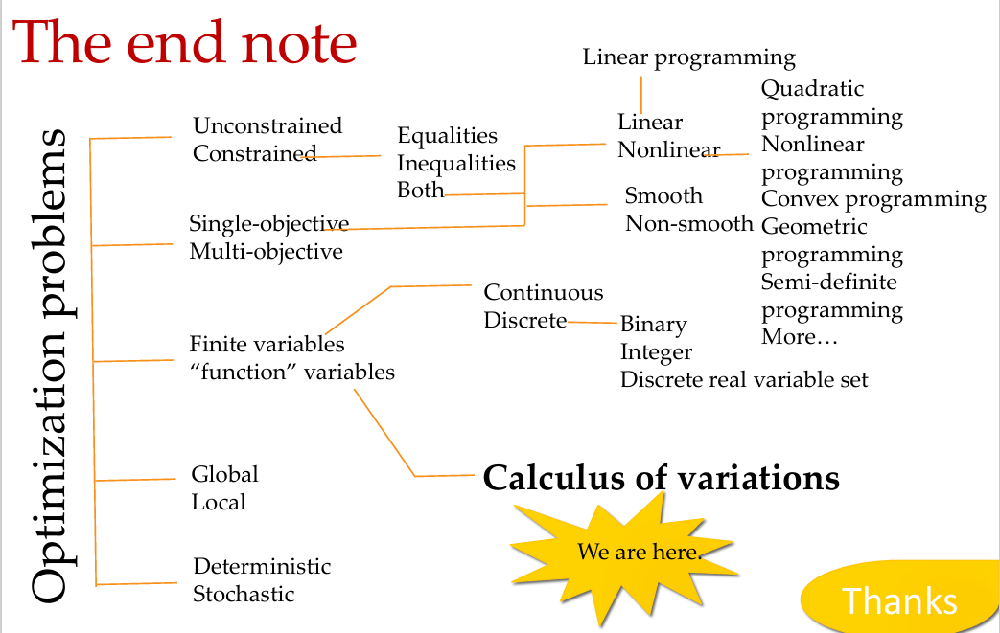
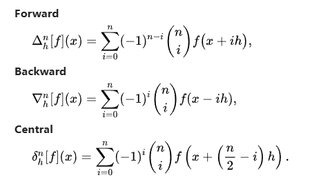
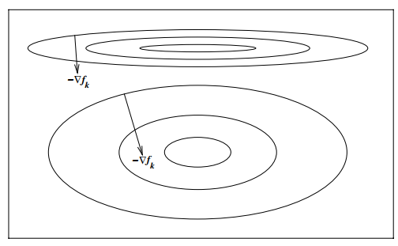
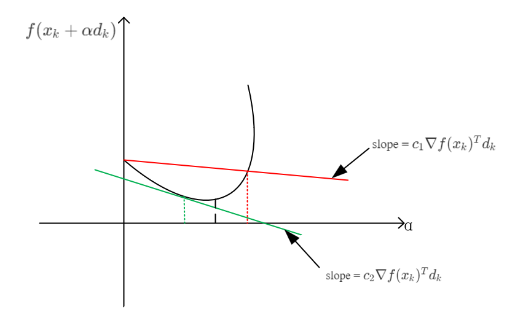

# The Classifications of Optimization Algorithms
There are some kinds of standards of classification, including how many objective function (***multi-objective optimization***), the types of objective and constraints (***equality, inequality, with constraints or without constraints***), the types of optimization variables, the nature of op. (***global op. or local op. and deterministic or stochastic***) .
## the types of objective and constraints
|type of problems | objective funtions | constraints |
|:----------------|--------------------|------------:|
|Linear Programming (LP)|  linear      |   linear    |
|Quadratic Programming (QP)| quadratic |   linear    |
|QCQP             |   quadratic        |   quadratic |

## the types of optimization variables
Continuous or discrete, deterministic or stochatic and etc.
## the nature of op.
It has to be mentioned that non-deterministic can solve deterministic problems.

# Linear Algebra
## Finite difference
The term "finite difference" is often used as an abbreviation of "finite difference approximation of derivatives", which is a method to approximate derivatives.
|type of difference | description |
|:----------------|--------------------|
|forward | $\Delta_h[f](x)=f(x+h)-f(x)$ |
|backward| $\nabla_h[f](x)=f(x)-f(x-h)$ |
|central | $\delta_h[f](x)=f(x+\frac{h}{2})-f(x-\frac{h}{2})=\Delta_{h/2}[f](x)+\nabla_{h/2}[f](x)$ |

where $\Delta,\nabla, and \delta$ are operators that maps a function into its difference.
Meanwhile, we can notice that if the funtion $f$ is symmetric (e.g. $|x| $ and etc.), the central difference is always zeros (OBVIOUSLY wrong! ). Some high order difference formulas are as follows.

**Richardson extrapolation** is a useful tool to get a more approximate estimate of $A^*$. The idea is that cutting off some error term will give more accuracy. Such that,

$$
\begin{equation}
\begin{split}
A^* & = A_0(h) + a_0h^{k_0} + a_1h^{k_1} + O(h^{k_2}) \\
A^* & = A_0(h/t) + a_0(h/t)^{k_0} + a_1(h/t)^{k_1} + O(h^{k_2})
\end{split}
\end{equation}
$$
If we try to eliminate the term $h^{k_0}$, the $A_1(h)$ will be gotten. So, by multipling $2nd$ formula $t^{k_0}$ and subtract $1st$ formula to give us,
$$(t^{k_0}-1)A^* = (t^{k_0}A_0(h/t)-A_0(h))+O(h^{k_1})$$

So, 
$$
A_1(h)=\frac{t^{k_0}A_0(h/t)-A_0(h)}{t^{k_0}-1}$$

More generally, we have,
$$
\begin{equation}
\begin{split}
A_{i+1}(h) & = \frac{t^{k_i}A_i(h/t)-A_i(h)}{t^{k_i}-1} \\
A^* & = A_{i+1}(h) + O(h^{k_{i+1}})
\end{split}
\end{equation}
$$

## Adjoint Method
We have learned how to calculate the derivative of single-variable functions whatever is scalar, vector and matrix. But this chapter, we will know how to calculate the derivative of multi-variable functions.
Consider the following problem,
$$
$$
# CVX

## The Introduction of Unconstraint Optimization
Two structures: **Line Search** and **Trust Region**. The differences between them is that line search has to identify search direction firstly and then calculate step size according to some rules(e.g. Armijo rules and exact line search rule and so on.) and trust region has to set a search region of $d(k)$ and identify step size $\alpha(k)$ and if $f(x^{k+1}) < f(x^k)$ is violated, the trust region will be shrinked.
The search directions of **Line Search** are as follows,

- Steepest descent directions $\nabla f(x^k)$. 
- Newtion direction $\nabla^{2} f(x^k)$.
- Quasi-Newtion direction $B_k \approx \nabla^{2} f(x^k)$.
- Conjugate gradient direction $d_{k+1}^{'}Ad_{k}=0 $.

The search directions based on the model of **Trust Region** are as follows,

The **Trust Region** method can be treated as **the dual version of gradient method**. The first step the trust region（like step size） will be set, and then the direction is decided by this trust region.
The reason why the trust region method was proposed is that approximation method is always used to approximate the local information of a smooth function, but the inaccurancy will increase with the degree of biasing. So how extend can we trust this approximation range? And trust region method occured.
There are some relations between Hessian matrix and convergence speed.

- Hessian✅ $\Rightarrow$ calculation cost $\uparrow$; approximate accuratly $\uparrow$, and trust region $\uparrow$
- Hessian❎ $\Rightarrow$ calculation cost $\downarrow$; approximate accuratly $\downarrow$, and trust region $\downarrow$

The procedures of trust region method is below,

- use the approximation of objective function $f(x^k + p) = f(x^k)+\nabla f(x^k)^Tp + \frac{1}{2}p^T \nabla^2 f(x^k) p$
- minimize $f(x^k + p)$ within the region of $||p||_2 \le \Delta_k$, i.e. 
$$p^k = \mathop{\arg \min}_{p:||p||_2 \le \Delta_k} f(x^k + p)$$

The key point is that the selection of trust region and the calculation of $p^k$.

Then we talk about **Scaling**.

The horizontal and vertical axes have the same scale. And the two contours have the same optimal value and optimal solution. The above contour is called poor scaling, because the change is giagantic when change $x$ through different direction. The below contour is well scaling. One example is that,
$$f(x) = 10^{10}x_1 + x_2$$
The tiny change in $x_1$ axe will change $f(x)$ greatly, but the change in $x_2$ axes is not.
**Steepest descent will not yield a good reduction in poor scaling situation, but Newton method is not for the second-order deriviation information.**

# Line Search Method

## Backtracking Line Search
==Wolfe Condition = The first condition (Armijo Rule) + the second condition (Curvature Rule)==

The reason why the Wolfe condition is proposed is that sometimes the step size $\alpha$ is too short or too long and it will make the progress of objective function smaller. So the condition is introduced in order to avoid this situation.

**The first condition (Armijo Rule)**
We hope that with the step size becoming larger the decrease of objective will be larger and vice versa. So this mind is descripted into mathematical symbols,
$$f(x_k) - f(x_k+\alpha d_k) \ge \alpha \gamma$$
Where $\gamma>0$ is parameter to set the extend of influence of $\alpha$ to the decrease of objective function. Consider the adaptivity of influence, when the function is steep, we hope the decreasing speed is quick (i.e. the step size is big), and when the function is flat, we hope it is slow. So the $\gamma$ is defined under this mind. So,
$$\gamma = -\nabla f(x_k)^Td_k$$
And the Armijo rule is formed, and add a parameter $c_1$ to improve its flexibility, which is ==$f(x_k+\alpha d_k) \le f(x_k)- c_1\alpha\nabla f(x_k)^T d_k$, $c_1 \in (0,1)$==. 
The problem is the setting of paramter $c_1$,

- $c_1=0$, this condition becomes $f(x_k+\alpha d_k) \le f(x_k)$, whici equals to the situation without Wolfe condition.
- $c_1=1$, the slope of $f(x_k)- c_1\alpha\nabla f(x_k)^T d_k$ is as same as the slope of $f(x_k+\alpha d_k)$ at $\alpha=0$. So this situation is invalid.

**The second condition (Curvature Rule)**
Due to $\nabla f(x_k)^Td_k<0$, the derivative of $f(x_k+\alpha d_k)$ at $\alpha=0$ is also smaller than 0. So the trend of function $f(x_k+\alpha d_k)$ will decrease at the neighbor of $\alpha =0$. According to this property, the slope of left part of each minimum point is minus and $\exist \alpha_1>0, s.t. \,slope \,in \,\alpha_1 = slope \,in\,\alpha*c_2,c_2>0$.
The above description gives us a sense that because the slope in minimum point is 0, the left part of minimum points alway exists a slope that equals $c_2$ multiplies the slope in $\alpha=0$ (according to **Mean Value Theorem**). The maximum point has the familiar properties. That is why we can use the follow inequality to shrink the range of $\alpha$ and make the lower bound smaller the minimum point.
$$
\nabla f(x_k+\alpha d_k)^Td_k \ge c_2 \nabla f(x_k)^T d_k
$$
Where $c_2 \in (c_1,1)$.

The green line determinates the lower bound, and the red line determinates the upper bound.

